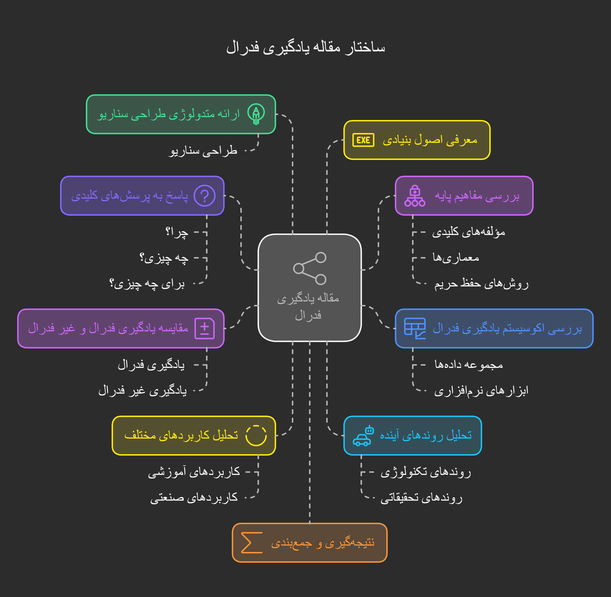

# Federated Learning Review

## 📌 Project Overview
This project is a comprehensive review of **Federated Learning**, conducted as part of the **Distributed Systems** course. The review explores the principles, benefits, challenges, and applications of Federated Learning, along with a discussion on recent advancements and open research directions.

## 📂 Project Structure
```
DS Project/
│-- 📄 README.md               # Project documentation (this file)
│-- 📄 report.pdf              # Final report summarizing the review
│-- 📂 papers/                 # Collection of research papers on Federated Learning
│   │-- A Tutorial on Federated Learning from Theory to Practice Foundations, Software Frameworks, Exemplar.pdf             # Paper 1
│   │-- Vertical federated learning a structured literature review.pdf             # Paper 2
│   │-- ...                    # More papers
│-- 📂 slides/                 # Presentation slides (if applicable)
│   │-- federated_learning.pptx
│-- 📂 code/                   # Code snippets (if applicable)
│   │-- experiments.ipynb      # Jupyter Notebook with experiments (if any)
│-- 📂 references/             # Additional resources
│   │-- books.md               # Recommended books/articles
```

## 🛤️ Project Roadmap
Below is the roadmap outlining the key steps in this review project.




## 📝 Contents
- **Introduction to Federated Learning**: Definition, motivation, and key concepts.
- **Architecture**: Centralized vs. decentralized approaches, aggregation methods.
- **Privacy & Security**: Differential privacy, secure aggregation, attack vectors.
- **Challenges**: Communication overhead, non-IID data, model convergence.
- **Applications**: Healthcare, finance, IoT, edge computing.
- **Future Directions**: Open problems, emerging research areas.

## 📜 How to Use
1. **Review the Papers**: Navigate to the `papers/` folder to access selected research papers.
2. **Read Summarized Notes**: Check the `notes/` folder for concise takeaways from each paper.
3. **Explore Additional Resources**: The `references/` folder provides extra reading material.
4. **View Presentation (if applicable)**: Slides available in the `slides/` folder.
5. **Run Experiments (if applicable)**: Code implementations, if any, are in the `code/` directory.

🖥 Framework Spotlight – OpenFL

Open Federated Learning (OpenFL) is an open-source framework designed to facilitate privacy-preserving, distributed machine learning across multiple institutions or edge devices. Developed with a modular and secure architecture, OpenFL supports a variety of aggregation algorithms, heterogeneous environments, and integration with deep learning libraries such as TensorFlow and PyTorch.

📄 Presentation: [View OpenFL Presentation]([url](https://drive.google.com/file/d/1pVvf1XzWsacxoIPfPHZhHQw63AfftFlT/view?usp=sharing)) (Google Drive link)
---

📌 **Author**: Mohammadreza Baghernezhad  
📅 **Course**: Distributed Systems  
🏫 **Institution**: Tarbiat Modares University
📧 **Contact**: mrezabmiri17@gmail.com

Happy Learning! 🚀


